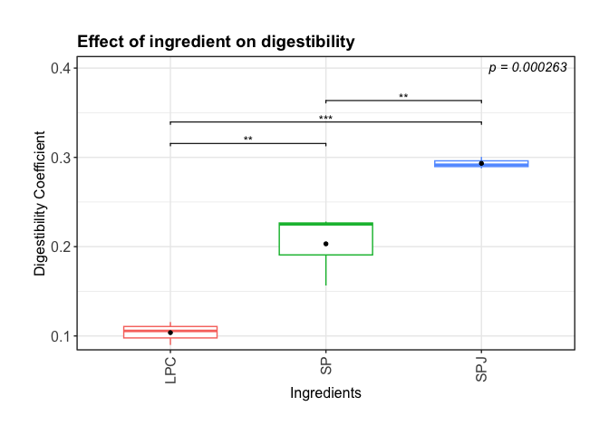

ProteinDigestibilityAnalysisNormalRMarkdown
================
Wendy Liu
2026-09-01

## Calculating Digestibility Coefficients

``` r
DigestibilityData <- read.csv("/Users/wendy/Downloads/Stirling_Digestibility.csv")

Controls = subset(DigestibilityData, DigestibilityData$Type == "Control")

Samples = subset(DigestibilityData, DigestibilityData$Type == "Sample")

# Calculate average Protein_Kjeldahl per Sample.Name in Controls
control_avg = aggregate(Protein_Kjeldahl ~ Sample.Name, data = Controls, FUN = mean)
names(control_avg)[2] = "averageControl"

# Merge that average into the Samples dataframe, matching by Sample.Name
Samples = merge(Samples, control_avg, by = "Sample.Name")

Samples$DigestibilityCoeff = 1 - (Samples$Protein_Kjeldahl/Samples$averageControl)
```

## Statistics

Question: Does the ingredient of the feed (Sample.Name) has a
significant impact on the digestibility coefficient (DigestibilityCoeff)
?

DigestibilityCoeff ~ Sample.Name

Digestibility coefficient is measured independently i.e. only after the
HG phase; It is also a continuous proportions (not from discrete
counts), especially with values clustering near 0 or 1.

The first thing we need to check is the normality of the data
contribution

``` r
range(Samples$DigestibilityCoeff, na.rm = TRUE)
```

    ## [1] 0.08990623 0.30054274

``` r
# This confirmed the proportions/percentages are indeed bounded 0-1

res.aov <- aov(DigestibilityCoeff ~ Sample.Name, data = Samples) #ANOVA

plot(res.aov, 2) #QQplot
```

<!-- -->

``` r
aov_residuals <- residuals(object = res.aov) #extract ANOVA residuals
shapiro.test(x = aov_residuals) #run shapiro-wilk test
```

    ## 
    ##  Shapiro-Wilk normality test
    ## 
    ## data:  aov_residuals
    ## W = 0.90936, p-value = 0.3114

``` r
#  p < 0.05 -> residuals does not significantly deviate from normality
```

Our proportional data meat the assumptions for a one-way anlaysis of
varianace and there is only one batch so no batch effect.

## ANOVA

``` r
m <- aggregate(Samples$DigestibilityCoeff, list(Samples$Sample.Name), FUN=mean)
m
```

    ##   Group.1         x
    ## 1     LPC 0.1036955
    ## 2      SP 0.2031793
    ## 3     SPJ 0.2933062

``` r
aov.sum <- summary(res.aov)  

res.ttest <- pairwise.t.test(Samples$DigestibilityCoeff, Samples$Sample.Name, p.adjust.method = "BH") #t-test with no correction

# Convert the pairwise t-test matrix into a tidy data frame
ttest_df <- as.data.frame(res.ttest$p.value) %>%
  rownames_to_column(var = "group1") %>%
  pivot_longer(
    cols = -group1,
    names_to = "group2",
    values_to = "p.value"
  ) %>%
  filter(!is.na(p.value))   # drop the empty upper-triangle cells

ttest_df
```

    ## # A tibble: 3 × 3
    ##   group1 group2  p.value
    ##   <chr>  <chr>     <dbl>
    ## 1 SP     LPC    0.00403 
    ## 2 SPJ    LPC    0.000254
    ## 3 SPJ    SP     0.00434

## Plots

``` r
library(ggplot2)
library(ggpubr)
```

    ## Warning: package 'ggpubr' was built under R version 4.4.3

``` r
library(dplyr)
library(tidyr)
# 1. Overall ANOVA p-value (replace with your actual overall ANOVA p-value)
p_values <- data.frame(
  label = paste0("p = ", signif(summary(res.aov)[[1]][["Pr(>F)"]][1], 3))
)

# 2. Prepare pairwise p-values for plotting
pairwise_p_values <- ttest_df %>%
  filter(p.value < 0.05) %>%
  mutate(
    label = case_when(
      p.value < 0.001 ~ "***",
      p.value < 0.01  ~ "**",
      p.value < 0.05  ~ "*",
      TRUE ~ "ns"
    )
  )

# 3. Set y.position for brackets
max_y <- max(Samples$DigestibilityCoeff, na.rm = TRUE)
pairwise_p_values$y.position <- seq(
  from = max_y * 1.05,
  by = max_y * 0.08,
  length.out = nrow(pairwise_p_values)
)

# 4. Plot (same as before, just referencing the new pairwise_p_values)
p <- ggplot(
  Samples,
  aes(x = Sample.Name, y = DigestibilityCoeff)
) +
  geom_boxplot(width = 0.6, aes(colour = Sample.Name)) +
  stat_summary(fun = mean, geom = "point", shape = 20, size = 2,
               colour = "black", aes(group = Sample.Name)) +
  geom_text(
    data = p_values,
    aes(x = Inf, y = Inf, label = label),
    inherit.aes = FALSE, hjust = 1.1, vjust = 1.5,
    fontface = "italic", colour = "black"
  ) +
  stat_pvalue_manual(
    pairwise_p_values,
    label = "label",
    xmin = "group1",
    xmax = "group2",
    y.position = "y.position",
    tip.length = 0.01,
    bracket.size = 0.4,
    size = 3.5,
    inherit.aes = FALSE
  ) +
  coord_cartesian(clip = "off") +
  scale_y_continuous(expand = expansion(mult = c(0.02, 0.18))) +
  theme_bw() +
  labs(x = "Ingredients", y = "Digestibility Coefficient",
       title = "Effect of ingredient on digestibility") +
  theme(
    plot.title = element_text(size = 14, face = "bold"),
    axis.text = element_text(size = 12),
    axis.title = element_text(size = 12, face = "plain"),
    axis.text.x = element_text(angle = 90, vjust = 0.5, hjust = 1),
    plot.margin = unit(c(1, 1, 1, 1), units = "cm")
  ) +
  theme(legend.position = "none")

p
```

<!-- -->
